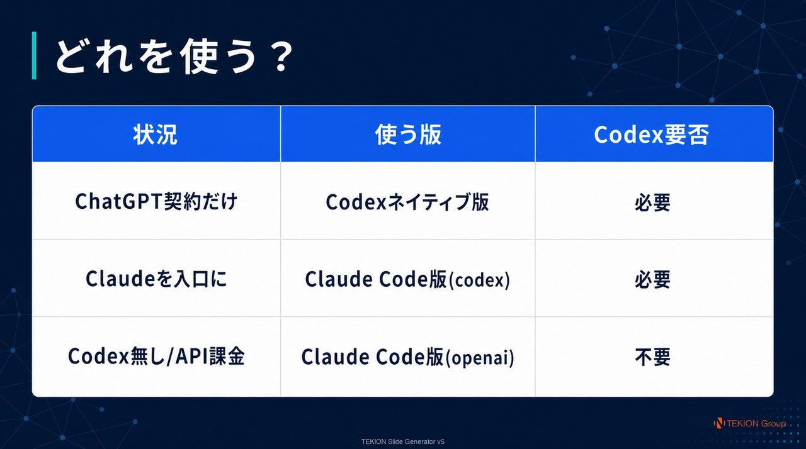
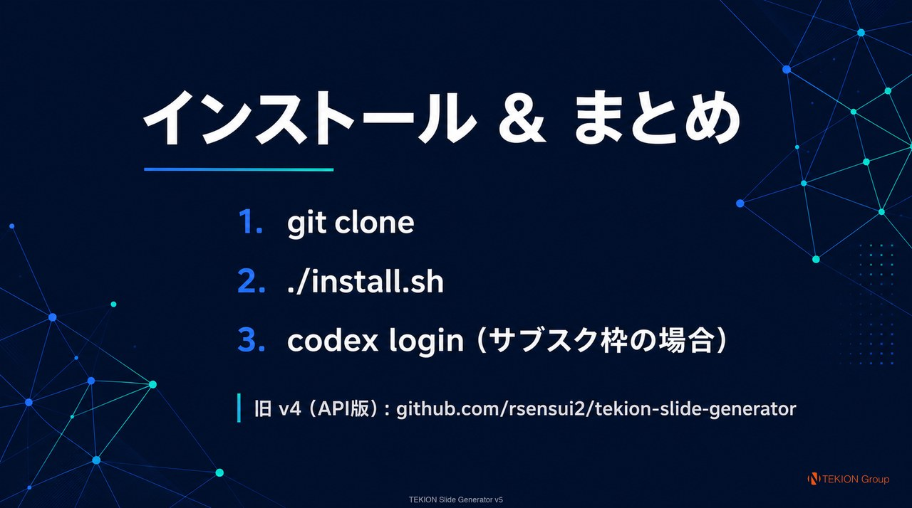

# TEKION Slide Generator v5

**Markdown / テキスト → 高品質な日本語 16:9 スライド → PPTX / PDF** を自動生成するスキル。
画像生成は OpenAI **gpt-image-2**。v5 では **ChatGPT / Codex のサブスクリプション枠**で生成できる
ようになり、API 従量課金なしでスライドが作れる（従来どおり API 課金でも利用可）。

- **v4 リポジトリ（旧・API 版）**: https://github.com/rsensui2/tekion-slide-generator
- **配布**: 公開（ソース公開）だが OSS ではない。未改変の利用は誰でも可（商用含む）、
  改変・再配布は事前許可制で禁止。詳細は [LICENSE](./LICENSE) / [NOTICE](./NOTICE)。

> **このリポジトリの説明スライド（`docs/slides/`）は、v5 自身で生成したものです。**

---

## 📑 説明スライド

以下のスライドはすべて **v5 自身が Codex サブスク枠で生成**したもの（フル解像度版は
[deck.pdf](docs/slides/tekion-slide-generator-v5-deck.pdf) をダウンロード）。







---

## 👶 はじめかた（非エンジニア向け・最短手順）

「プログラミングはわからないけど使ってみたい」人向けに、上から順にコピペすれば動く手順です。

### 0. 先に用意するもの（前提）

| 必要なもの | なぜ必要 | 入手 |
|---|---|---|
| **ChatGPT / Codex のサブスク契約** | 画像生成（gpt-image-2）を**追加課金なし**で使うため | ChatGPT 有料プラン |
| **Codex CLI（必須）** | スライドの絵を「サブスク枠」で作る仕組みは Codex が握っている。**これが無いとサブスク枠生成はできない** | https://developers.openai.com/codex |
| Python 3.10 以上 | PPTX/PDF への書き出しに使う | mac は標準で入っていることが多い |

> **重要**: 「ChatGPT 契約だけで作る（＝追加料金なし）」を選ぶなら、**Codex CLI のインストールとログインが必須**です。
> Codex を入れたくない場合は、後述の「OpenAI API で使う」方法（こちらは API の従量課金）になります。

### 1. Codex を入れてログイン（ターミナルで）

```bash
# Codex CLI をインストール（未導入なら）→ 公式手順: https://developers.openai.com/codex
codex login        # ブラウザが開くので ChatGPT でサインイン
```
`codex login` が成功すれば、サブスク枠で画像を作る準備は完了です。

### 2. このツールを入れる

```bash
git clone https://github.com/rsensui2/tekion-slide-generator-v5.git
cd tekion-slide-generator-v5
pip install Pillow python-pptx     # 書き出しに必要な部品
./install.sh                       # Codex版・Claude Code版の両方を導入
```

### 3. 動くか確認

```bash
codex --version          # バージョンが出ればOK
ls ~/.codex/auth.json    # ファイルが見えればログイン済み
```

### 4. 使ってみる（プロンプト例）

`codex` を起動して、下のように**日本語でそのまま話しかける**だけです（ツール名を言わなくてOK）。

```
このテキストを10枚くらいの提案書スライドにして。表紙→課題→解決策→価格→まとめの構成で。
内容: （ここに資料の中身を貼り付け）
```

ほかの言い方の例（どれでも発動します）:
- 「`~/Desktop/kickoff.md` を 16:9 のプレゼンスライドにして。PPTXとPDFで欲しい」
- 「この企画書を登壇用のピッチデッキにして。1枚1メッセージで、ビジュアル重視」
- 「研修資料を章ごとにスライド化して。営業資料っぽいバランス型で」

数分待つと、`deck.pptx` / `deck.pdf` と各スライド画像が出来上がります。

> **Codex を入れたくない / API 課金でいい人へ**: Codex は使わず、Claude Code で
> 「`--provider openai` でスライドを作って」と頼めば、OpenAI の API（従量課金）で同じものが作れます。
> その場合は事前に `echo "OPENAI_API_KEY=sk-..." >> ~/.claude/.env.local` でキーを設定してください。

---

## 🆕 v4 → v5 の変更点

v4 は「OpenAI / Gemini の **API（従量課金）** でスライドを並列生成する」ツールでした。
v5 はその画像生成を **Codex 内蔵の gpt-image-2（同一モデル）** に載せ替え、**サブスク枠**で
動かせるようにしたのが最大の進化です。

| # | 変更点 | 内容 |
|:--:|---|---|
| 1 | **サブスク枠で生成（目玉）** | gpt-image-2 を ChatGPT/Codex のサブスク枠で実行。API 従量課金を回避。`OPENAI_API_KEY` は既定で自動除去（気づかず課金される事故防止）。 |
| 2 | **2 版構成** | **Codex ネイティブ版**（ChatGPT 契約だけで完結）と **Claude Code 版**（Claude を設計・レビュー UI に）を同梱。 |
| 3 | **真の並列（子 codex exec）** | 各スライドを独立した子 `codex exec` で並列生成。実測 **2K で並列 20 → 20 枚を約 67 秒**。 |
| 4 | **課金モードトグル** | `--billing subscription`（既定）/ `--billing api`（OpenAI API 従量課金）を明示選択。実行時にどちらかをログ表示。 |
| 5 | **レート制限フォールバック** | 失敗時に並列度を段階的に下げ（8→4→2→1）バックオフ再試行。 |
| 6 | **認証セーフ** | 並列ワーカーは `auth.json` を**コピー**した隔離環境で動作し、ファンアウト前に warmup でトークン更新。トークン競合による失効を防止。 |
| 7 | **v4 機能は維持** | Visual / Balanced 2 スタイル、16:9 2K ネイティブ、ロゴ色保全、PPTX/PDF 出力、providers 抽象（openai/gemini/codex）。 |

---

## 📦 2 つの版

| | Codex ネイティブ版 | Claude Code 版 |
|---|---|---|
| 場所 | `skills/codex/tekion-slide-generator-v5` | `skills/claude-code/tekion-slide-generator-v5` |
| ホスト | Codex CLI | Claude Code |
| 必要な契約 | **ChatGPT/Codex のみ** | Claude ＋（サブスク枠なら ChatGPT/Codex、API なら OpenAI/Gemini キー） |
| 画像生成 | Codex 内蔵 gpt-image-2（サブスク枠） | 既定 codex（サブスク枠）／ `--provider openai`・`gemini`（API 課金）も可 |
| 向く用途 | 契約 1 本で完結・ゼロコンフィグ・配布 | 設計→生成→レビュー往復、プロバイダ切替 |

**迷ったら Codex ネイティブ版**（ChatGPT 契約だけで動く）。

---

## 🛠️ インストールと環境構築

### どの版・どの構成を使う？（決定マトリクス）

| あなたの状況 | 使う版 | provider | **Codex 要否** | 課金 |
|---|---|---|:---:|---|
| ChatGPT 契約だけで完結したい | **Codex ネイティブ版** | 内蔵 | **必要** | サブスク枠 |
| Claude を入口に、サブスク枠で生成 | **Claude Code 版** | `codex`（既定） | **必要** | サブスク枠 |
| **Codex を入れたくない / API 課金でよい** | **Claude Code 版** | `openai` / `gemini` | **不要** | API 従量課金 |

#### (b) Codex のインストールが必要なのはどんなとき？

**「サブスク枠（ChatGPT/Codex 契約）で gpt-image-2 を使いたいとき」だけ**です。
サブスク枠の認証は Codex CLI が握っているため、
- **Codex ネイティブ版**は Codex 上で動くので当然 Codex が必須。
- **Claude Code 版でも `--provider codex`（既定）** はサブスク枠生成なので Codex CLI（インストール＋ログイン）が必要。

#### (c) Codex が無い環境でも使える（OpenAI API 経由）

Codex を入れていない／入れたくない場合でも、**Claude Code 版を `--provider openai`（または `gemini`）**で
使えば、OpenAI / Gemini の **API 経由（従量課金）** でそのまま動きます（＝ v4 と同じ動作）。
この経路に **Codex は不要**。OpenAI/Gemini の API キーを `~/.claude/.env.local` に置くだけです。

```bash
# Codex 無し・API 課金で使う例（Claude Code 版）
echo "OPENAI_API_KEY=sk-..." >> ~/.claude/.env.local
# 生成時に provider を openai に
#   ...generate_slides_parallel.py --provider openai --api-key "$OPENAI_API_KEY" ...
```

### (a) インストール手順

共通の前提:
- **Python 3.10+** ＋ `Pillow` / `python-pptx`（Claude 版で API を使う場合は `requests` / `Jinja2` も）。
  ```bash
  pip install Pillow python-pptx requests Jinja2
  ```
- **サブスク枠で使う場合のみ**: Codex CLI（https://developers.openai.com/codex ）をインストールし、`codex login`。

一括インストール:
```bash
git clone https://github.com/rsensui2/tekion-slide-generator-v5.git
cd tekion-slide-generator-v5
./install.sh            # 両方（Codex 版・Claude Code 版）
# ./install.sh --codex  # Codex 版だけ
# ./install.sh --claude # Claude Code 版だけ
```

手動インストール:
- Codex 版: `cp -R skills/codex/tekion-slide-generator-v5 ~/.codex/skills/`
- Claude 版: `cp -R skills/claude-code/tekion-slide-generator-v5 ~/.claude/skills/`

---

## 🚀 使い方

- **Codex 版**: `codex` で「スライドを作って。内容は …」。既定で並列生成 → 16:9 仕上げ → PPTX/PDF。
- **Claude Code 版**: Claude Code で「Codex でスライドを作って」（サブスク枠）。
  API で動かすなら `--provider openai|gemini`。

出力: `deck.pptx` / `deck.pdf` ＋ 各スライド画像。

### プロンプト例（コピペ可）

**新規作成**
- 「この議事録 `~/Desktop/q2.md` を 12 枚の提案書スライドにして。PPTX と PDF で」
- 「下のテキストを登壇用ピッチデッキに。1 枚 1 メッセージ、ビジュアル重視で」
- 「製品紹介を営業資料っぽいバランス型（図解＋箇条書き）でスライド化して」

**調整・作り直し**（作ったあとに続けて言うだけ）
- 「3 枚目だけ作り直して。グラフをもっと大きく、文字は減らして」
- 「全体をもっとシンプルに。1 枚あたりの情報量を半分に」
- 「表紙だけ visual スタイルで派手にして」 ／ 「ロゴは入れないで」
- 「急ぎなので 20 並列で一気に作って」（`--max-parallel 20`）

**スタイル指定の語彙**: 「営業資料っぽく＝balanced」「登壇/ピッチっぽく＝visual」。
ブランドは既定で TEKION（オレンジ）。自社 brand にしたいときは `references/presets/` に自前プリセットを置く。

### 課金モード（`--billing`）

| モード | 指定 | 挙動 |
|---|---|---|
| subscription（既定） | 無指定 | サブスク枠。`OPENAI_API_KEY` を自動除去 |
| api | `--billing api` / `CODEX_SLIDES_BILLING=api` | OpenAI API 従量課金（キー使用） |

実行時にどちらのモードかをログへ明示（黙ってキーを剥がさない）。

### 並列・レート制限

- 既定 `--max-parallel 8`。急ぎは 20 まで実証済み（2K・20 枚 67 秒）。
- サブスク枠の画像ターンは枠消費が速い（公式: 通常の 3-5 倍）。**累積**で日次/週次 usage limit に達し得る。
- 失敗時は並列度を自動デグレードして再試行。`token_revoked` が出たら `codex login` で再ログイン。

---

## 🔗 関連

- **v4（旧・API 版）**: https://github.com/rsensui2/tekion-slide-generator
- [Codex CLI](https://developers.openai.com/codex) / [Claude Code Skills](https://docs.claude.com/en/docs/agents/skills)
- [OpenAI Images API](https://platform.openai.com/docs/api-reference/images) / [Gemini 画像生成](https://ai.google.dev/gemini-api/docs/image-generation)

## 📜 ライセンス

[LICENSE](./LICENSE)（ソース公開のプロプライエタリ）。未改変利用は誰でも可（商用含む）、
改変・派生物作成・再配布・各種表示や焼き込みフッター/ロゴの削除は **TEKION の事前書面許可**が必要。
OSI 定義の「オープンソース」ではない。正式運用前に TEKION 法務でのレビューを推奨。
